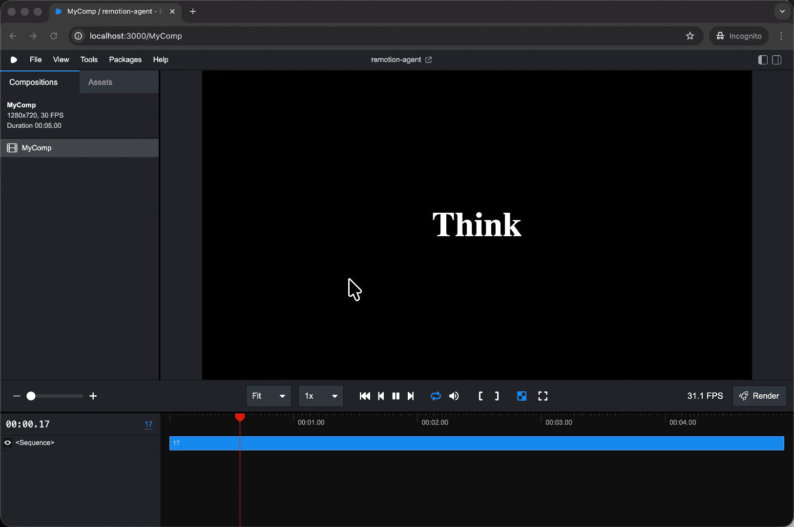

# Remotion

AI-powered video generation using Remotion with Claude Code agent skills.

## Prerequisites

- Node.js >= 18
- npm

## Setup

```sh
npm install
```

## Usage

Start the Remotion studio for live preview:

```sh
npm run dev
```

Render a video:

```sh
npm run render
```

Bundle for deployment:

```sh
npm run build
```

Lint and type-check:

```sh
npm run lint
```

Upgrade Remotion:

```sh
npm run upgrade
```

## Tech Stack

- [Remotion](https://remotion.dev) v4 — programmatic video rendering with React
- React 19
- TypeScript
- Tailwind CSS v4

## Demo


